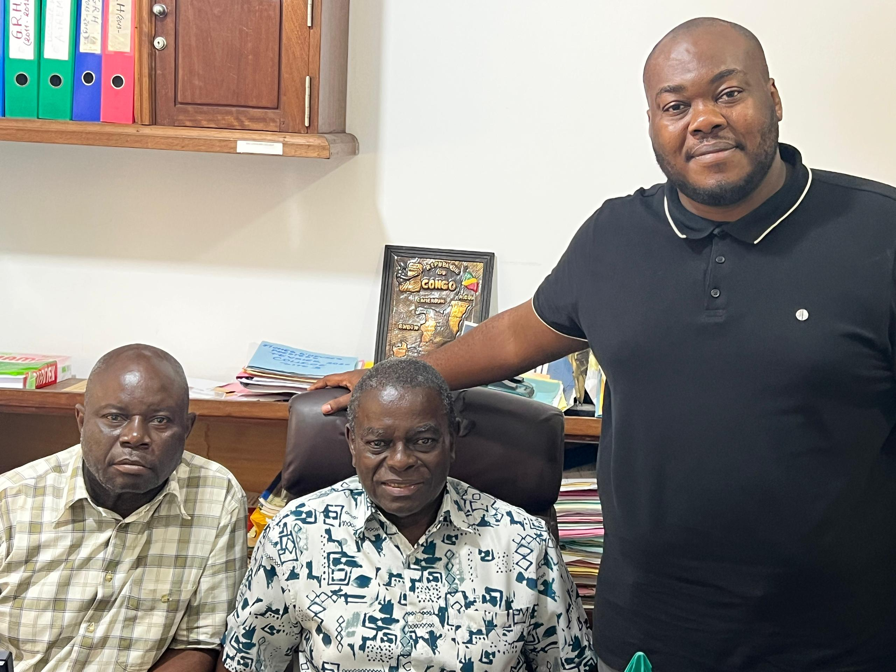

# Dom Helder Camara — digitalisation du processus de bulletins

> **Bulletins trimestriels : 3 semaines de production réduites à 3 jours.**

## Carte courte (à coller sur la landing)

**Groupe scolaire Dom Helder Camara — Brazzaville · 1 500+ élèves**

Plateforme sur-mesure conçue et livrée pour Dom Helder Camara qui digitalise l'intégralité du processus de bulletins — saisie des notes par les enseignants, calculs automatiques selon les coefficients de l'établissement, génération PDF aux couleurs de l'école, distribution aux familles, archive permanente.

*En production depuis novembre 2025. Gain mesuré : 3 semaines de production trimestrielle réduites à 3 jours (×7).*

---

## Le contexte

Le Groupe scolaire Dom Helder Camara, à Brazzaville, accueille **plus de 1 500 élèves**. Comme la majorité des établissements privés congolais, la production des bulletins trimestriels mobilisait administration et corps enseignant pendant trois semaines complètes :

- Saisie des notes répartie entre cahiers papier et fichiers Excel partagés
- Calculs de moyennes effectués manuellement selon les coefficients propres à l'établissement
- Impression et reproduction physique des bulletins
- Distribution aux familles
- Archivage papier

Au-delà du temps perdu, ce mode de production exposait l'école à plusieurs risques permanents : erreurs de calcul difficiles à détecter avant remise aux familles, retards qui décalaient les conseils de classe, et bulletins perdus qu'aucun classeur ne permettait de retrouver rapidement.

## Notre intervention

Niqo Services a conçu et livré pour Dom Helder Camara une **plateforme sur-mesure dédiée à l'intégralité du processus de bulletins**. Le périmètre fonctionnel a été cadré directement avec la direction et le corps enseignant de l'établissement.

**Couverture fonctionnelle livrée**

- Saisie des notes par les enseignants depuis n'importe quel poste connecté
- Calculs automatiques des moyennes selon les coefficients et règles propres à DHC
- Génération des bulletins au format PDF, mise en page aux couleurs de l'école
- Distribution sécurisée aux familles
- Archive permanente, consultable par classe, par élève et par trimestre

La plateforme est **en production depuis novembre 2025**.

## Résultats mesurés

| Indicateur | Avant | Après |
|---|---|---|
| Production d'un trimestre complet de bulletins | **3 semaines** | **3 jours** |
| Calcul des moyennes | Manuel, sujet à erreur | Automatique, verrouillé |
| Distribution aux familles | Physique | Numérique |
| Archive | Classeurs papier | Consultable en ligne |

Le gain de temps (**×7**) libère les équipes administratives et enseignantes précisément sur la période critique de fin de trimestre — au moment où elles préparent également les conseils de classe et la rentrée du trimestre suivant.

## Visuel

*Alain Steven Makosso-Della, co-fondateur de Niqo Services, avec la direction du Groupe scolaire Dom Helder Camara à Brazzaville.*

---

## À compléter avant mise en ligne

- [ ] Niveau(x) couvert(s) par le groupe scolaire (maternelle / primaire / secondaire)
- [ ] Mode de distribution effectif des bulletins aux familles (email, portail, WhatsApp, remise physique du PDF imprimé...)
- [ ] Nombre de trimestres déjà bouclés sur la plateforme depuis novembre 2025
- [ ] Citation courte signée par un membre de la direction
- [ ] **Accord écrit DHC** autorisant la mention du nom de l'établissement et la publication de la photographie pour la communication commerciale et institutionnelle de Niqo Services (`publishable: true` une fois obtenu)
